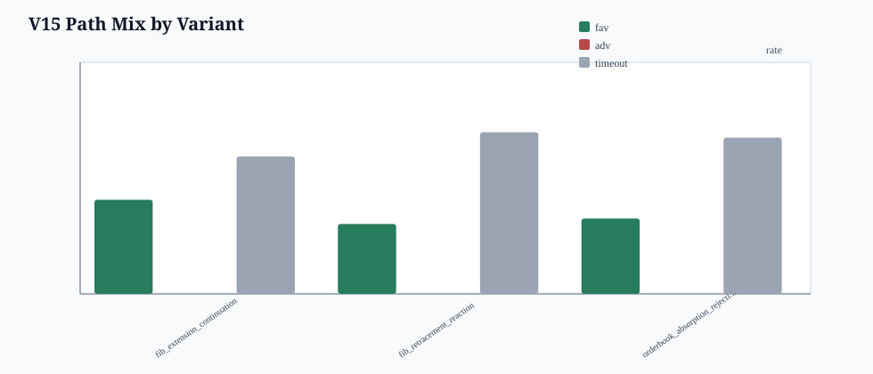
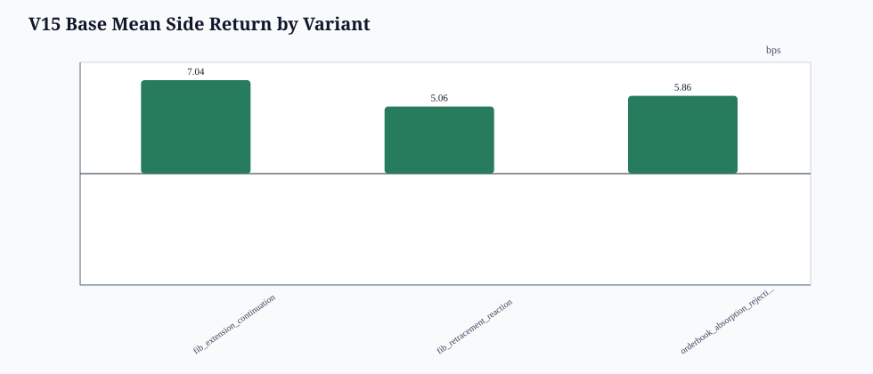
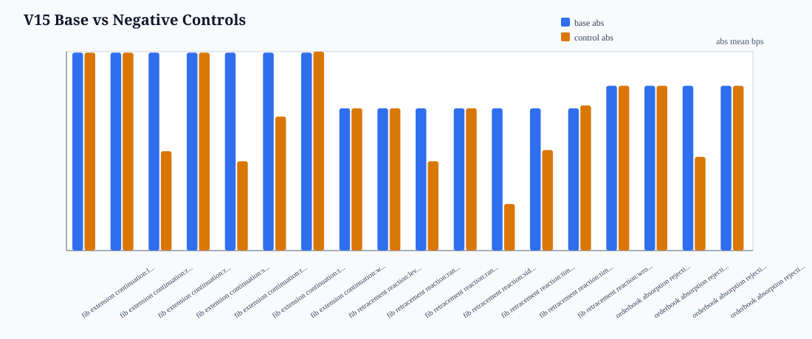
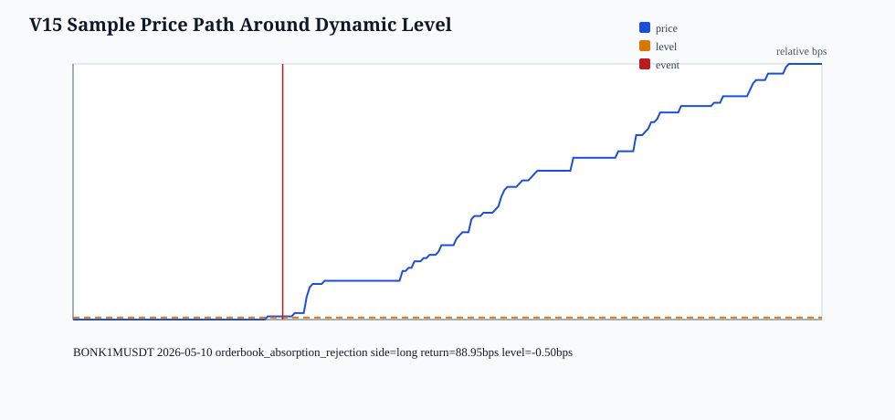

# BONK V15 Fibonacci / RSI / Book Level Diagnostics

- generated_at: `2026-05-15T14:38:08Z`
- run_tag: `20260514_bonk_v10_stage1_pilot`
- strategy_id: `v15_fibonacci_rsi_book_level_path_diagnostics`
- guardrail: `research_only_not_trading_rule_no_execution_recommendation_no_alpha_claim`
- stance: research-only factor/path diagnostics; no trades CSV, no execution recommendation, no alpha claim.

## Inputs

- V10c panel files: `86`
- V10c panel rows read: `1945574`
- usable rows: `1945574`
- fold rows: `6`

## Primary Read

- primary variant: `fib_extension_continuation` control=`base` events=`406`
- favorable/adverse/timeout proxy: `0.4064` / `0.0000` / `0.5936`
- mean side return: `7.0368` bps; median `0.0000` bps; max_date_share `0.8670`; max_symbol_share `0.5271`
- control_abs_ge_base_abs rows: `11` / `21`

## Plots

## Interpretation Boundary

- Marker here means a dynamic price level. It is not a maker quote, not a fill price, and not a wait-until-filled instruction.
- RSI is treated as lagging context and a divergence filter; it is not allowed to create a standalone signal.
- Order book fields are confirmation diagnostics around a level touch, not standalone alpha claims.
- Negative controls are expected to kill most attractive-looking rows; if controls match base, the report should be read as no path separation.

## Outputs

- levels: `date/bonk_v15_fib_rsi_book_levels_20260514_bonk_v10_stage1_pilot.csv`
- events: `date/bonk_v15_fib_rsi_book_events_20260514_bonk_v10_stage1_pilot.csv`
- path_profiles: `date/bonk_v15_fib_rsi_book_path_profiles_20260514_bonk_v10_stage1_pilot.csv`
- summary: `date/bonk_v15_fib_rsi_book_summary_20260514_bonk_v10_stage1_pilot.csv`
- negative_controls: `date/bonk_v15_fib_rsi_book_negative_controls_20260514_bonk_v10_stage1_pilot.csv`
- diagnostics: `date/bonk_v15_fib_rsi_book_diagnostics_20260514_bonk_v10_stage1_pilot.csv`
- manifest: `date/bonk_v15_fib_rsi_book_manifest_20260514_bonk_v10_stage1_pilot.csv`

## Diagnostics

- `panel_files`: `86`
- `panel_rows`: `1945574`
- `usable_rows`: `1945574`
- `fold_rows`: `6`
- `level_rows`: `883`
- `event_rows_including_controls`: `7064`
- `base_event_rows`: `883`
- `control_event_rows`: `6181`
- `blockers`: `none`
- `stance`: `factor_path_diagnostics_only_no_trades_csv_no_execution_recommendation`
