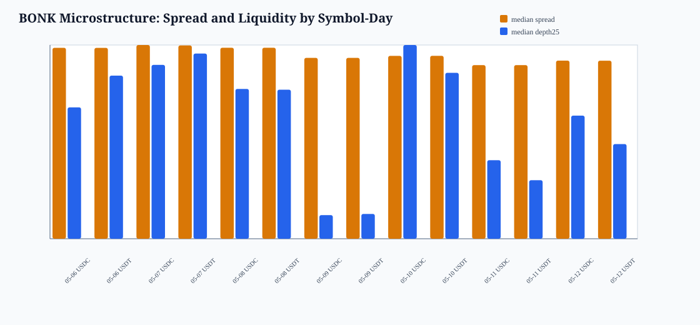
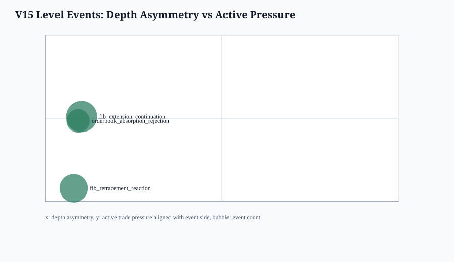
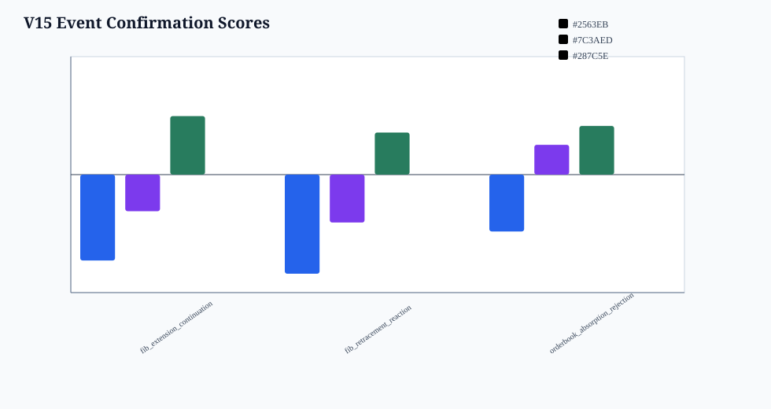
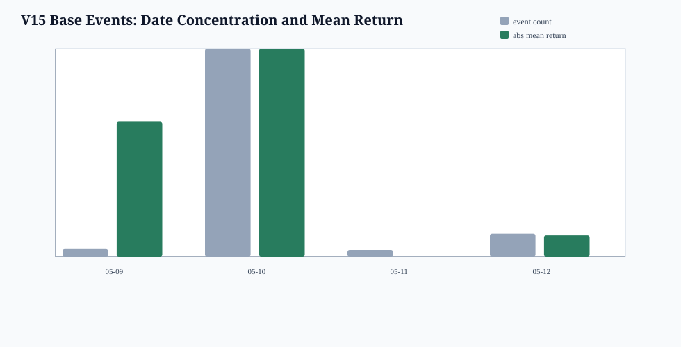

# BONK V15 Longbridge-Style Microstructure Analysis

- run_tag: `20260514_bonk_v10_stage1_pilot`
- guardrail: `research_only_not_trading_rule_no_execution_recommendation_no_alpha_claim`
- stance: research-only diagnostics; no trading advice, no execution recommendation, no alpha claim.
- note: this applies the `longbridge-market-microstructure` framework to local BONK V10c historical event panels rather than Longbridge live CLI snapshots.

## 价差与流动性

- panel part files: `86`
- symbol-days: `14`
- median spread range: `1.2907` to `1.4404` bps
- median depth25 range: `199.7740` to `1640.3876`

## 盘口不对称

- `queue_imbalance_25` is used as the local depth asymmetry proxy: positive means bid-side depth dominates, negative means ask-side depth dominates.
- In V15 level events, asymmetry is not yet sufficient as a standalone discriminator; the strongest rows still have high date concentration.

## 订单流压力

- `trade_buy_amount / trade_sell_amount`, `trade_flow_imbalance`, and `mlofi_roll10_l10` are used as active-flow pressure proxies.
- The visual result says the event timestamps are often inside a common directional state; controls must separate this before any factor claim.

## 挂单墙

- Top-of-book JSON is parsed around V15 base events. The report estimates defending-side wall score and nearest-wall distance to the dynamic level.
- Current evidence is diagnostic only: walls help explain some touches, but same-time/wrong-symbol controls are still too strong.

## 短线方向偏向

- strongest base variant by mean path return: `fib_extension_continuation`
- events: `406`
- favorable rate: `0.4064`
- mean side return: `7.0368` bps
- max date share: `0.8670`
- max symbol share: `0.5271`
- negative controls with abs(control) >= abs(base): `11` / `21`
- interpretation: if wrong-symbol or same-anchor controls are close to base, the signal is probably common market state or event-time trend, not unique level geometry.

## Outputs

- daily microstructure CSV: `date/bonk_v15_microstructure_skill_daily_20260514_bonk_v10_stage1_pilot.csv`
- event confirmation CSV: `date/bonk_v15_microstructure_skill_events_20260514_bonk_v10_stage1_pilot.csv`
- event summary CSV: `date/bonk_v15_microstructure_skill_summary_20260514_bonk_v10_stage1_pilot.csv`

## Bottom Line

This microstructure pass supports the V15 interpretation: the charts show real directional/event-time structure, but they do not yet prove Fibonacci or order-book levels are independently causal. The next useful step is stricter random-touch controls within the same date/regime and beta-neutral wrong-symbol adjustment.
