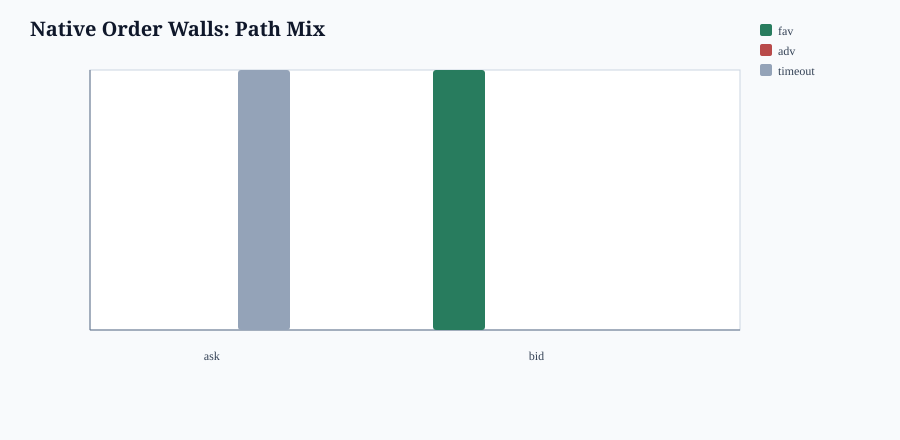
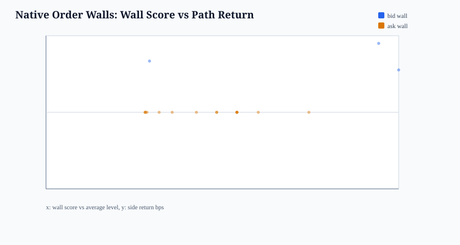
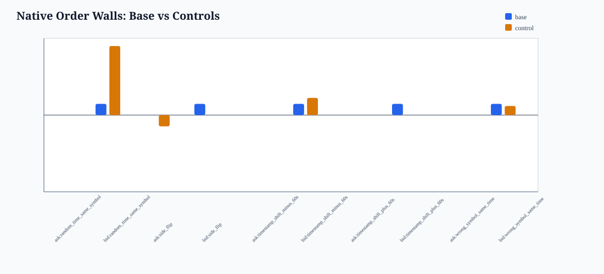

# BONK V15 Native Order-Wall Microstructure Analysis

- run_tag: `20260514_bonk_v10_stage1_pilot`
- guardrail: `research_only_not_trading_rule_no_execution_recommendation_no_alpha_claim`
- stance: research-only diagnostics; no trading advice, no execution recommendation, no alpha claim.
- method: native order-wall first; Fibonacci is not used to select events.

## What Changed

- This report finds walls directly from `bid_top_levels_json` / `ask_top_levels_json`.
- A wall is a level whose amount is at least `3.0x` the average amount of that side's top levels.
- A touch event is kept only when mid is within `max(1.5 bps, 2 * spread_bps)` of that wall.

## Spread & Liquidity

- panel parts: `86`
- native wall base events: `18`
- control events: `90`

## Order Walls

- `ask` wall events: `15`
  mean wall score: `4.8069x`; mean distance: `0.6829` bps; survival 30 events: `1.0000`
  favorable/adverse/timeout: `0.0000` / `0.0000` / `1.0000`
  mean side return: `0.0000` bps; max_date_share: `1.0000`
- `bid` wall events: `3`
  mean wall score: `8.0047x`; mean distance: `1.0763` bps; survival 30 events: `0.3333`
  favorable/adverse/timeout: `1.0000` / `0.0000` / `0.0000`
  mean side return: `11.0929` bps; max_date_share: `1.0000`

## Negative Controls

- controls with abs(control mean) >= abs(base mean): `7`
- If timestamp/wrong-symbol controls stay close, the wall is mostly identifying market state, not a standalone wall reaction.

## Outputs

- events CSV: `date/bonk_v15_native_order_wall_events_20260514_bonk_v10_stage1_pilot.csv`
- summary CSV: `date/bonk_v15_native_order_wall_summary_20260514_bonk_v10_stage1_pilot.csv`
- controls CSV: `date/bonk_v15_native_order_wall_controls_20260514_bonk_v10_stage1_pilot.csv`

## Bottom Line

This is the cleaner wall-first analysis. It should replace the earlier wording where Fibonacci and walls were blended together. The first question is now whether actual detected walls survive and alter path distribution; only after that should any Fibonacci confluence be considered.
