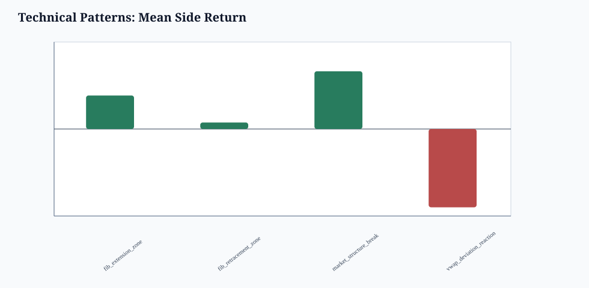
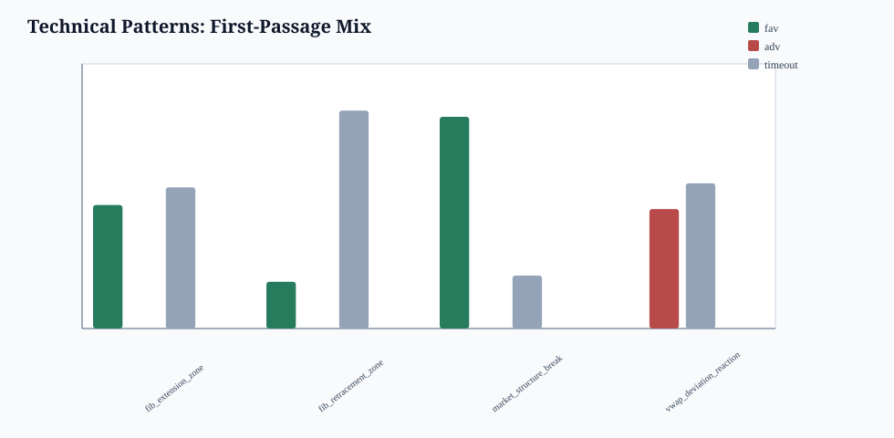
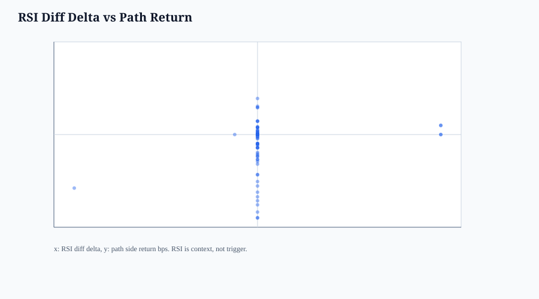
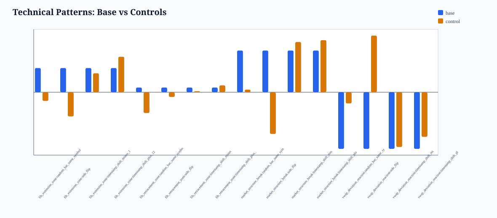

# BONK V15 Technical Analysis Skill Report

- run_tag: `20260514_bonk_v10_stage1_pilot`
- guardrail: `research_only_not_trading_rule_no_execution_recommendation_no_alpha_claim`
- stance: research-only diagnostics; no trading advice, no execution recommendation, no alpha claim.
- method: event-time OHLCV bars, fixed TA constructs, causal trailing swings only.

## Method

- panel part files: `86`
- event-time bar size: `300` L2 events
- bars: `6492`
- base pattern events: `134`
- control events: `536`
- Patterns tested: Fibonacci retracement zone, Fibonacci extension zone, RSI diff divergence with structure, market structure break, VWAP deviation reaction.

## Sharp Edges Applied

- Fibonacci levels are treated as zones, not exact prices.
- RSI is lagging context; divergence requires structure context and is not used alone.
- Every row has side-flip, time-shift, and random-bar controls.
- Positive-looking rows with high date concentration or control overlap are rejected as path diagnostics only.

## Pattern Read

- best mean-return base pattern: `market_structure_break`
- events: `5`
- favorable/adverse/timeout: `0.8000` / `0.0000` / `0.2000`
- mean side return: `39.5180` bps
- max_date_share: `0.6000`; max_symbol_share: `0.6000`
- controls with abs(control mean) >= abs(base mean): `9`
- important rejection: the top mean-return row is not automatically useful; sample count, date concentration, and control overlap dominate the verdict.

| pattern | events | mean return bps | favorable | adverse | max date | control overlap | read |
| --- | ---: | ---: | ---: | ---: | ---: | ---: | --- |
| `fib_extension_zone` | 30 | 22.9033 | 0.4667 | 0.0000 | 0.7333 | 2 | date concentrated |
| `fib_retracement_zone` | 17 | 4.4379 | 0.1765 | 0.0000 | 0.4706 | 3 | too few samples |
| `market_structure_break` | 5 | 39.5180 | 0.8000 | 0.0000 | 0.6000 | 3 | too few samples |
| `vwap_deviation_reaction` | 82 | -53.6030 | 0.0000 | 0.4512 | 0.7927 | 1 | date concentrated |

## Outputs

- bars CSV: `date/bonk_v15_technical_analysis_bars_20260514_bonk_v10_stage1_pilot.csv`
- events CSV: `date/bonk_v15_technical_analysis_events_20260514_bonk_v10_stage1_pilot.csv`
- summary CSV: `date/bonk_v15_technical_analysis_summary_20260514_bonk_v10_stage1_pilot.csv`
- controls CSV: `date/bonk_v15_technical_analysis_controls_20260514_bonk_v10_stage1_pilot.csv`

## Bottom Line

This TA pass is more honest than drawing lines on raw events. It shows whether standard structures survive controls on event-time bars. If controls overlap base or date concentration dominates, the result remains a visual/path phenomenon rather than a strategy candidate.
