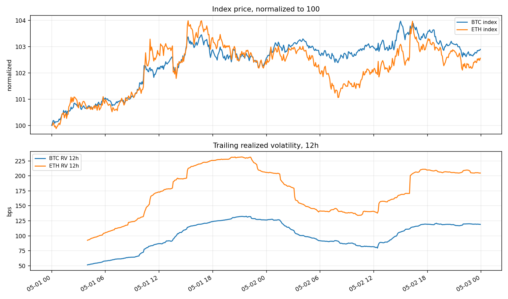
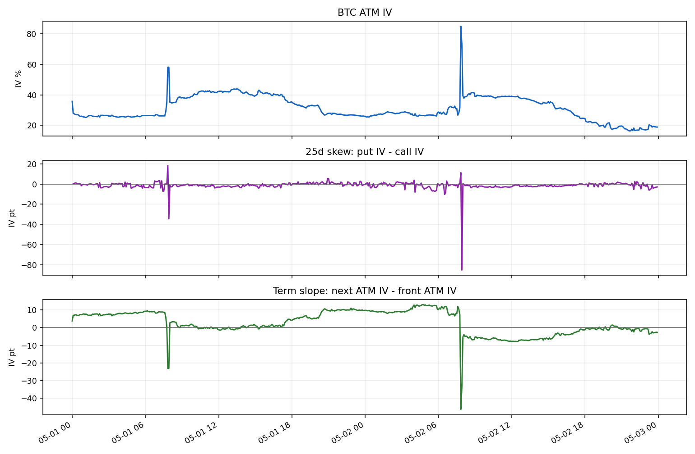
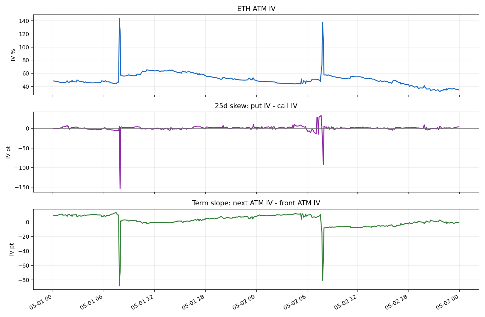
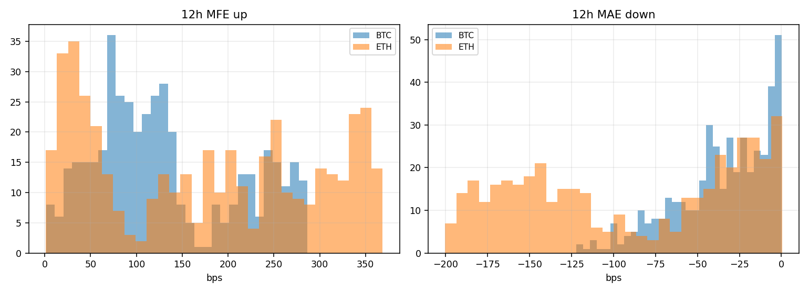
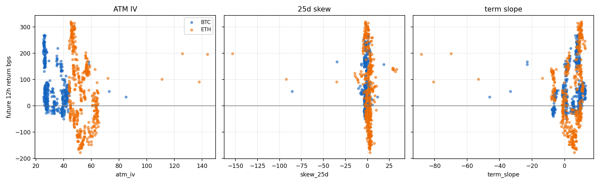
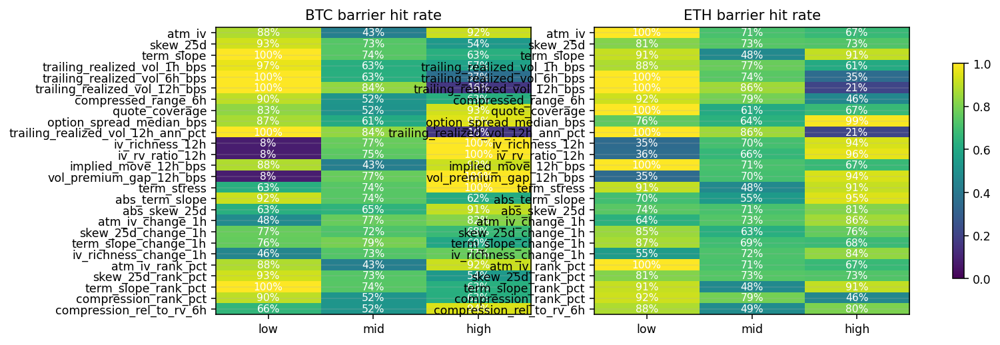
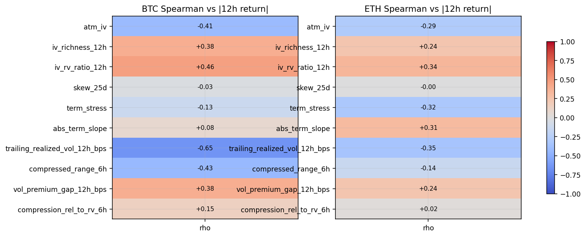

# BTC/ETH Options Regime 样例报告 v0

当前定位: 本报告只证明 path-label / regime-report 框架可以运行；两日 BTC/ETH options 样例不作为 alpha 结论。后续主研究线转向 BONK CEX + Bullish L2，复用这里的数学框架，而不是复用这里的两日 Spearman 或 bucket 结果。

- `run_tag`: `20260512_options_regime_v0`
- 数据范围：当前本地 Deribit Tardis 样例数据 `2025-05-01..2025-05-02`。
- 结论边界：两天样本只用于验证期权 surface、12h path label 和图表管线，不能证明因子有效。
- 12h barrier：`max(75bps, 0.75 * trailing_realized_vol_12h_bps)`。
- `vol_expansion`：`future_realized_vol_12h_bps > 1.25 * trailing_realized_vol_12h_bps`。

## 输出文件

- Regime state parquet：`data/tardis/v1/derived/btc_options_regime_state/btc_options_regime_state_20260512_options_regime_v0.parquet`
- 12h path label parquet：`data/tardis/v1/derived/btc_12h_path_labels/btc_12h_path_labels_20260512_options_regime_v0.parquet`
- Summary CSV：`date/btc_options_regime_summary_20260512_options_regime_v0.csv`
- Factor tests CSV：`date/btc_options_regime_factor_tests_20260512_options_regime_v0.csv`
- Spearman CSV：`date/btc_options_regime_spearman_20260512_options_regime_v0.csv`

## 覆盖与标签分解

| underlying | rows | valid labels | future missing | barrier hit | upper first | lower first | median 12h abs move bps | median ATM IV |
|---|---:|---:|---:|---:|---:|---:|---:|---:|
| BTC | 576 | 432 | 144 | 73.4% | 65.0% | 8.3% | 47.0 | 28.5 |
| ETH | 575 | 431 | 144 | 76.1% | 53.6% | 22.5% | 102.6 | 49.3 |

## 样例图

## Spearman IC 快读

`bps` 是变量单位，表示价格或波动幅度；`Spearman rho` 是无单位的排序相关，表示因子高低和未来目标高低是否单调一致。
两日样本高度自相关，所以这里的 `rho` 只用于排查建模方向，不用于显著性判断。

| underlying | factor | n | rho signed return | rho abs return | rho future RV | rho hit |
|---|---|---:|---:|---:|---:|---:|
| BTC | `trailing_realized_vol_12h_bps` | 384 | -0.60 | -0.65 | -0.90 | -0.75 |
| BTC | `iv_rv_ratio_12h` | 384 | 0.40 | 0.46 | 0.91 | 0.71 |
| BTC | `compressed_range_6h` | 408 | -0.41 | -0.43 | -0.25 | -0.24 |
| BTC | `atm_iv` | 432 | -0.46 | -0.41 | 0.37 | 0.12 |
| BTC | `iv_richness_12h` | 384 | 0.31 | 0.38 | 0.88 | 0.71 |
| BTC | `vol_premium_gap_12h_bps` | 384 | 0.31 | 0.38 | 0.88 | 0.71 |
| BTC | `compression_rel_to_rv_6h` | 408 | 0.17 | 0.15 | 0.31 | 0.38 |
| BTC | `term_stress` | 432 | -0.21 | -0.13 | 0.44 | 0.31 |
| BTC | `abs_term_slope` | 432 | 0.13 | 0.08 | -0.37 | -0.21 |
| BTC | `skew_25d` | 431 | 0.01 | -0.03 | -0.42 | -0.38 |
| ETH | `trailing_realized_vol_12h_bps` | 384 | -0.94 | -0.35 | -0.92 | -0.65 |
| ETH | `iv_rv_ratio_12h` | 384 | 0.85 | 0.34 | 0.92 | 0.55 |
| ETH | `term_stress` | 431 | -0.26 | -0.32 | 0.03 | -0.15 |
| ETH | `abs_term_slope` | 431 | 0.43 | 0.31 | 0.12 | 0.36 |
| ETH | `atm_iv` | 431 | -0.36 | -0.29 | -0.05 | -0.28 |
| ETH | `iv_richness_12h` | 384 | 0.78 | 0.24 | 0.89 | 0.53 |
| ETH | `vol_premium_gap_12h_bps` | 384 | 0.78 | 0.24 | 0.89 | 0.53 |
| ETH | `compressed_range_6h` | 408 | -0.44 | -0.14 | -0.32 | -0.41 |
| ETH | `compression_rel_to_rv_6h` | 408 | 0.02 | 0.02 | 0.02 | -0.04 |
| ETH | `skew_25d` | 431 | -0.20 | -0.00 | -0.22 | -0.09 |

## 扩展因子说明

| factor | 含义 |
|---|---|
| `iv_richness_12h` | `atm_iv - trailing_realized_vol_12h_ann_pct`，衡量期权 IV 相对过去 12h 已实现波动是否偏贵。 |
| `iv_rv_ratio_12h` | `atm_iv / trailing_realized_vol_12h_ann_pct`，相对波动定价倍数。 |
| `implied_move_12h_bps` | 用 ATM IV 折算出的 12h 隐含一标准差波动，单位 bps。 |
| `vol_premium_gap_12h_bps` | `implied_move_12h_bps - trailing_realized_vol_12h_bps`，隐含路径空间相对已实现路径的差。 |
| `term_stress` | `front ATM IV - next ATM IV`，近端 IV 相对远端越贵，短期压力越强。 |
| `abs_term_slope` / `abs_skew_25d` | 不关心方向，只看期限结构或偏斜是否处于极端状态。 |
| `*_change_1h` | 过去 1h 的 surface 变化，捕捉 IV、skew、term 是否在快速重定价。 |
| `*_rank_pct` | 当前值在本样本中的百分位，仅用于 v0 诊断，长窗后应改成滚动历史百分位。 |
| `compression_rel_to_rv_6h` | 6h 价格区间相对 6h realized vol 的比例，粗略描述“震荡路径是否被压扁”。 |

## Regime Bucket 快读

下面只展示每个因子的 low/mid/high 分桶后，12h 内先触发任一方向 barrier 的比例。它是研究诊断，不是策略胜率。

| underlying | factor | bucket | rows | valid | hit rate | median factor | median abs 12h move bps |
|---|---|---|---:|---:|---:|---:|---:|
| BTC | `atm_iv` | high | 192 | 165 | 92.1% | 39.7 | 35.7 |
| BTC | `atm_iv` | low | 192 | 110 | 88.2% | 25.6 | 174.4 |
| BTC | `atm_iv` | mid | 192 | 157 | 43.3% | 28.5 | 28.3 |
| ETH | `atm_iv` | high | 192 | 183 | 67.2% | 58.1 | 93.8 |
| ETH | `atm_iv` | low | 192 | 98 | 100.0% | 44.2 | 203.5 |
| ETH | `atm_iv` | mid | 191 | 150 | 71.3% | 49.3 | 109.4 |
| BTC | `skew_25d` | high | 191 | 151 | 53.6% | 0.6 | 37.0 |
| BTC | `skew_25d` | low | 193 | 152 | 92.8% | -2.9 | 45.0 |
| BTC | `skew_25d` | mid | 191 | 128 | 73.4% | -1.1 | 53.2 |
| ETH | `skew_25d` | high | 191 | 163 | 73.0% | 3.3 | 118.2 |
| ETH | `skew_25d` | low | 192 | 155 | 81.3% | -1.7 | 96.0 |
| ETH | `skew_25d` | mid | 192 | 113 | 73.5% | 1.2 | 93.4 |
| BTC | `term_slope` | high | 192 | 192 | 63.0% | 9.2 | 59.4 |
| BTC | `term_slope` | low | 192 | 71 | 100.0% | -4.2 | 34.1 |
| BTC | `term_slope` | mid | 192 | 169 | 74.0% | 1.3 | 40.7 |
| ETH | `term_slope` | high | 192 | 192 | 90.6% | 9.4 | 132.4 |
| ETH | `term_slope` | low | 192 | 92 | 91.3% | -5.3 | 55.3 |
| ETH | `term_slope` | mid | 191 | 147 | 47.6% | 2.0 | 111.1 |
| BTC | `trailing_realized_vol_1h_bps` | high | 191 | 122 | 57.4% | 38.4 | 23.2 |
| BTC | `trailing_realized_vol_1h_bps` | low | 191 | 151 | 96.7% | 17.8 | 135.3 |
| BTC | `trailing_realized_vol_1h_bps` | mid | 190 | 155 | 62.6% | 26.7 | 44.1 |
| ETH | `trailing_realized_vol_1h_bps` | high | 191 | 129 | 61.2% | 61.3 | 68.6 |
| ETH | `trailing_realized_vol_1h_bps` | low | 191 | 146 | 87.7% | 33.3 | 113.8 |
| ETH | `trailing_realized_vol_1h_bps` | mid | 190 | 153 | 77.1% | 43.5 | 120.1 |
| BTC | `trailing_realized_vol_6h_bps` | high | 184 | 101 | 36.6% | 97.7 | 18.0 |
| BTC | `trailing_realized_vol_6h_bps` | low | 184 | 169 | 100.0% | 55.0 | 148.1 |
| BTC | `trailing_realized_vol_6h_bps` | mid | 184 | 138 | 63.0% | 68.1 | 40.0 |
| ETH | `trailing_realized_vol_6h_bps` | high | 184 | 108 | 35.2% | 171.6 | 91.5 |
| ETH | `trailing_realized_vol_6h_bps` | low | 184 | 172 | 100.0% | 95.2 | 122.9 |
| ETH | `trailing_realized_vol_6h_bps` | mid | 184 | 128 | 74.2% | 107.5 | 57.3 |
| BTC | `trailing_realized_vol_12h_bps` | high | 176 | 116 | 16.4% | 124.4 | 17.7 |
| BTC | `trailing_realized_vol_12h_bps` | low | 176 | 156 | 100.0% | 81.7 | 63.4 |
| BTC | `trailing_realized_vol_12h_bps` | mid | 176 | 112 | 83.9% | 105.5 | 51.4 |
| ETH | `trailing_realized_vol_12h_bps` | high | 176 | 111 | 20.7% | 215.7 | 102.7 |
| ETH | `trailing_realized_vol_12h_bps` | low | 176 | 169 | 100.0% | 137.3 | 130.0 |
| ETH | `trailing_realized_vol_12h_bps` | mid | 176 | 104 | 85.6% | 178.3 | 33.7 |
| BTC | `compressed_range_6h` | high | 173 | 123 | 62.6% | 166.8 | 24.0 |
| BTC | `compressed_range_6h` | low | 209 | 178 | 89.9% | 84.6 | 78.0 |
| BTC | `compressed_range_6h` | mid | 170 | 107 | 52.3% | 107.6 | 35.4 |
| ETH | `compressed_range_6h` | high | 161 | 117 | 46.2% | 254.6 | 62.2 |
| ETH | `compressed_range_6h` | low | 184 | 156 | 92.3% | 111.4 | 76.5 |
| ETH | `compressed_range_6h` | mid | 207 | 135 | 79.3% | 175.8 | 125.2 |
| BTC | `quote_coverage` | high | 164 | 88 | 93.2% | 0.9 | 27.6 |
| BTC | `quote_coverage` | low | 199 | 181 | 83.4% | 0.6 | 87.0 |
| BTC | `quote_coverage` | mid | 213 | 163 | 51.5% | 0.7 | 32.2 |
| ETH | `quote_coverage` | high | 189 | 141 | 67.4% | 0.8 | 62.2 |
| ETH | `quote_coverage` | low | 194 | 144 | 100.0% | 0.6 | 199.4 |
| ETH | `quote_coverage` | mid | 192 | 146 | 61.0% | 0.7 | 84.9 |
| BTC | `option_spread_median_bps` | high | 115 | 61 | 95.1% | 30.0 | 207.6 |
| BTC | `option_spread_median_bps` | low | 197 | 124 | 87.1% | 15.0 | 50.0 |
| BTC | `option_spread_median_bps` | mid | 264 | 247 | 61.1% | 25.0 | 33.8 |
| ETH | `option_spread_median_bps` | high | 192 | 102 | 99.0% | 480.0 | 210.0 |
| ETH | `option_spread_median_bps` | low | 197 | 143 | 75.5% | 15.0 | 78.9 |
| ETH | `option_spread_median_bps` | mid | 186 | 186 | 64.0% | 45.0 | 94.2 |
| BTC | `trailing_realized_vol_12h_ann_pct` | high | 176 | 116 | 16.4% | 33.6 | 17.7 |
| BTC | `trailing_realized_vol_12h_ann_pct` | low | 176 | 156 | 100.0% | 22.1 | 63.4 |
| BTC | `trailing_realized_vol_12h_ann_pct` | mid | 176 | 112 | 83.9% | 28.5 | 51.4 |
| ETH | `trailing_realized_vol_12h_ann_pct` | high | 176 | 111 | 20.7% | 58.3 | 102.7 |
| ETH | `trailing_realized_vol_12h_ann_pct` | low | 176 | 169 | 100.0% | 37.1 | 130.0 |
| ETH | `trailing_realized_vol_12h_ann_pct` | mid | 176 | 104 | 85.6% | 48.2 | 33.7 |
| BTC | `iv_richness_12h` | high | 176 | 154 | 100.0% | 16.8 | 51.4 |
| BTC | `iv_richness_12h` | low | 176 | 89 | 7.9% | -8.2 | 18.3 |
| BTC | `iv_richness_12h` | mid | 176 | 141 | 76.6% | 4.5 | 46.2 |
| ETH | `iv_richness_12h` | high | 176 | 169 | 94.1% | 18.2 | 125.2 |
| ETH | `iv_richness_12h` | low | 176 | 83 | 34.9% | -12.0 | 101.6 |
| ETH | `iv_richness_12h` | mid | 176 | 132 | 70.5% | 3.6 | 59.6 |
| BTC | `iv_rv_ratio_12h` | high | 176 | 165 | 100.0% | 1.8 | 60.4 |
| BTC | `iv_rv_ratio_12h` | low | 176 | 89 | 7.9% | 0.8 | 18.3 |
| BTC | `iv_rv_ratio_12h` | mid | 176 | 130 | 74.6% | 1.2 | 35.3 |
| ETH | `iv_rv_ratio_12h` | high | 176 | 169 | 96.4% | 1.5 | 125.2 |
| ETH | `iv_rv_ratio_12h` | low | 176 | 81 | 35.8% | 0.8 | 101.6 |
| ETH | `iv_rv_ratio_12h` | mid | 176 | 134 | 66.4% | 1.1 | 57.7 |
| BTC | `implied_move_12h_bps` | high | 192 | 165 | 92.1% | 146.8 | 35.7 |
| BTC | `implied_move_12h_bps` | low | 192 | 110 | 88.2% | 94.9 | 174.4 |
| BTC | `implied_move_12h_bps` | mid | 192 | 157 | 43.3% | 105.5 | 28.3 |
| ETH | `implied_move_12h_bps` | high | 192 | 183 | 67.2% | 215.1 | 93.8 |
| ETH | `implied_move_12h_bps` | low | 192 | 98 | 100.0% | 163.6 | 203.5 |
| ETH | `implied_move_12h_bps` | mid | 191 | 150 | 71.3% | 182.6 | 109.4 |
| BTC | `vol_premium_gap_12h_bps` | high | 176 | 154 | 100.0% | 62.4 | 51.4 |
| BTC | `vol_premium_gap_12h_bps` | low | 176 | 89 | 7.9% | -30.3 | 18.3 |
| BTC | `vol_premium_gap_12h_bps` | mid | 176 | 141 | 76.6% | 16.5 | 46.2 |
| ETH | `vol_premium_gap_12h_bps` | high | 176 | 169 | 94.1% | 67.4 | 125.2 |
| ETH | `vol_premium_gap_12h_bps` | low | 176 | 83 | 34.9% | -44.3 | 101.6 |
| ETH | `vol_premium_gap_12h_bps` | mid | 176 | 132 | 70.5% | 13.2 | 59.6 |
| BTC | `term_stress` | high | 192 | 71 | 100.0% | 4.2 | 34.1 |
| BTC | `term_stress` | low | 192 | 192 | 63.0% | -9.2 | 59.4 |
| BTC | `term_stress` | mid | 192 | 169 | 74.0% | -1.3 | 40.7 |
| ETH | `term_stress` | high | 192 | 92 | 91.3% | 5.3 | 55.3 |
| ETH | `term_stress` | low | 192 | 192 | 90.6% | -9.4 | 132.4 |
| ETH | `term_stress` | mid | 191 | 147 | 47.6% | -2.0 | 111.1 |
| BTC | `abs_term_slope` | high | 192 | 185 | 61.6% | 9.3 | 53.7 |
| BTC | `abs_term_slope` | low | 192 | 112 | 92.0% | 0.8 | 42.4 |
| BTC | `abs_term_slope` | mid | 192 | 135 | 74.1% | 6.5 | 35.1 |
| ETH | `abs_term_slope` | high | 192 | 188 | 94.7% | 9.5 | 130.5 |
| ETH | `abs_term_slope` | low | 192 | 113 | 69.9% | 1.1 | 59.2 |
| ETH | `abs_term_slope` | mid | 191 | 130 | 54.6% | 6.1 | 107.6 |
| BTC | `abs_skew_25d` | high | 191 | 150 | 90.7% | 3.0 | 49.5 |
| BTC | `abs_skew_25d` | low | 194 | 146 | 63.0% | 0.4 | 54.1 |
| BTC | `abs_skew_25d` | mid | 190 | 135 | 65.2% | 1.5 | 39.3 |
| ETH | `abs_skew_25d` | high | 192 | 166 | 81.3% | 3.8 | 123.9 |
| ETH | `abs_skew_25d` | low | 192 | 136 | 74.3% | 0.7 | 64.8 |
| ETH | `abs_skew_25d` | mid | 191 | 129 | 71.3% | 2.0 | 109.2 |
| BTC | `atm_iv_change_1h` | high | 187 | 165 | 81.8% | 1.4 | 55.2 |
| BTC | `atm_iv_change_1h` | low | 188 | 91 | 48.4% | -2.6 | 23.1 |
| BTC | `atm_iv_change_1h` | mid | 189 | 164 | 76.8% | -0.3 | 50.4 |
| ETH | `atm_iv_change_1h` | high | 188 | 157 | 86.0% | 2.0 | 113.3 |
| ETH | `atm_iv_change_1h` | low | 188 | 119 | 63.9% | -2.9 | 106.3 |
| ETH | `atm_iv_change_1h` | mid | 187 | 143 | 73.4% | -0.9 | 68.6 |
| BTC | `skew_25d_change_1h` | high | 188 | 137 | 67.9% | 1.7 | 57.5 |
| BTC | `skew_25d_change_1h` | low | 188 | 155 | 76.8% | -2.1 | 47.4 |
| BTC | `skew_25d_change_1h` | mid | 187 | 127 | 72.4% | -0.0 | 33.7 |
| ETH | `skew_25d_change_1h` | high | 188 | 139 | 76.3% | 2.8 | 109.2 |
| ETH | `skew_25d_change_1h` | low | 188 | 153 | 85.0% | -2.9 | 105.8 |
| ETH | `skew_25d_change_1h` | mid | 187 | 127 | 63.0% | -0.3 | 90.8 |
| BTC | `term_slope_change_1h` | high | 188 | 122 | 59.8% | 1.3 | 39.3 |
| BTC | `term_slope_change_1h` | low | 189 | 153 | 76.5% | -1.0 | 36.4 |
| BTC | `term_slope_change_1h` | mid | 187 | 145 | 79.3% | 0.1 | 58.6 |
| ETH | `term_slope_change_1h` | high | 188 | 135 | 68.1% | 1.6 | 106.3 |
| ETH | `term_slope_change_1h` | low | 188 | 153 | 86.9% | -1.3 | 114.7 |
| ETH | `term_slope_change_1h` | mid | 187 | 131 | 69.5% | 0.3 | 62.2 |
| BTC | `iv_richness_change_1h` | high | 172 | 150 | 76.7% | 1.9 | 46.7 |
| BTC | `iv_richness_change_1h` | low | 172 | 76 | 46.1% | -3.9 | 19.8 |
| BTC | `iv_richness_change_1h` | mid | 172 | 146 | 73.3% | -0.6 | 40.8 |
| ETH | `iv_richness_change_1h` | high | 172 | 149 | 83.9% | 2.6 | 65.9 |
| ETH | `iv_richness_change_1h` | low | 172 | 98 | 55.1% | -4.3 | 95.5 |
| ETH | `iv_richness_change_1h` | mid | 172 | 125 | 72.0% | -1.6 | 106.6 |
| BTC | `atm_iv_rank_pct` | high | 192 | 165 | 92.1% | 83.5 | 35.7 |
| BTC | `atm_iv_rank_pct` | low | 192 | 110 | 88.2% | 16.8 | 174.4 |
| BTC | `atm_iv_rank_pct` | mid | 192 | 157 | 43.3% | 50.1 | 28.3 |
| ETH | `atm_iv_rank_pct` | high | 192 | 183 | 67.2% | 83.4 | 93.8 |
| ETH | `atm_iv_rank_pct` | low | 192 | 98 | 100.0% | 16.8 | 203.5 |
| ETH | `atm_iv_rank_pct` | mid | 191 | 150 | 71.3% | 50.0 | 109.4 |
| BTC | `skew_25d_rank_pct` | high | 191 | 151 | 53.6% | 83.5 | 37.0 |
| BTC | `skew_25d_rank_pct` | low | 193 | 152 | 92.8% | 17.0 | 45.0 |
| BTC | `skew_25d_rank_pct` | mid | 191 | 128 | 73.4% | 50.2 | 53.2 |
| ETH | `skew_25d_rank_pct` | high | 191 | 163 | 73.0% | 83.5 | 118.2 |
| ETH | `skew_25d_rank_pct` | low | 192 | 155 | 81.3% | 16.8 | 96.0 |
| ETH | `skew_25d_rank_pct` | mid | 192 | 113 | 73.5% | 50.3 | 93.4 |
| BTC | `term_slope_rank_pct` | high | 192 | 192 | 63.0% | 83.4 | 59.4 |
| BTC | `term_slope_rank_pct` | low | 192 | 71 | 100.0% | 16.8 | 34.1 |
| BTC | `term_slope_rank_pct` | mid | 192 | 169 | 74.0% | 50.1 | 40.7 |
| ETH | `term_slope_rank_pct` | high | 192 | 192 | 90.6% | 83.4 | 132.4 |
| ETH | `term_slope_rank_pct` | low | 192 | 92 | 91.3% | 16.8 | 55.3 |
| ETH | `term_slope_rank_pct` | mid | 191 | 147 | 47.6% | 50.1 | 111.1 |
| BTC | `compression_rank_pct` | high | 173 | 123 | 62.6% | 86.7 | 24.0 |
| BTC | `compression_rank_pct` | low | 209 | 178 | 89.9% | 19.3 | 78.0 |
| BTC | `compression_rank_pct` | mid | 170 | 107 | 52.3% | 53.7 | 35.4 |
| ETH | `compression_rank_pct` | high | 161 | 117 | 46.2% | 84.2 | 62.2 |
| ETH | `compression_rank_pct` | low | 184 | 156 | 92.3% | 16.8 | 76.5 |
| ETH | `compression_rank_pct` | mid | 207 | 135 | 79.3% | 52.8 | 125.2 |
| BTC | `compression_rel_to_rv_6h` | high | 184 | 159 | 94.3% | 1.9 | 53.3 |
| BTC | `compression_rel_to_rv_6h` | low | 184 | 94 | 66.0% | 1.2 | 51.0 |
| BTC | `compression_rel_to_rv_6h` | mid | 184 | 155 | 52.3% | 1.5 | 26.5 |
| ETH | `compression_rel_to_rv_6h` | high | 184 | 173 | 80.3% | 1.7 | 98.0 |
| ETH | `compression_rel_to_rv_6h` | low | 184 | 132 | 87.9% | 1.1 | 73.0 |
| ETH | `compression_rel_to_rv_6h` | mid | 184 | 103 | 48.5% | 1.4 | 113.0 |

## 建模含义

这版把问题从“单个链上事件是否推价格”切到更稳的价格序列问题：

- 用 Deribit options surface 描述市场对未来波动、偏斜和期限结构的定价。
- 用 12h path label 描述之后是否真的走出足够路径，而不是只看固定时点 return。
- 用分桶表先看变量和路径标签有没有单调性或平台感，暂时不碰机器学习。

当前两日样本中，最后 12h 被明确标成 `future_missing`，避免用不存在的未来数据伪造标签。
如果要判断是否有真实机会，下一步至少需要 30 天以上数据，并按 discovery / validation / forward 分开。
