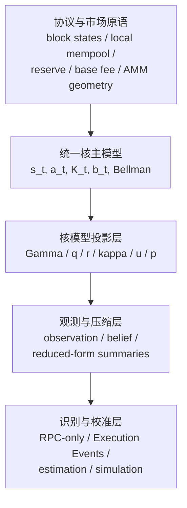

# 项目总图

## 目的
用一张统一结构图说明：这套研究从现在开始只承认一个理论中心，即统一状态-动作-转移核模型；其他页面只能作为它的原语、投影、压缩或校准配套。

## 统一接口
从这一页开始，整个项目统一采用同一套文档接口：

- 对象类型：`可直接观测`、`事件重建`、`RPC弱代理`、`研究latent`
- 证据来源：`当前仓库代码`、`外部官方资料`、`建模假设`

默认通用表头如下：

| 对象 | 当前状态 | 证据来源 | 当前锚点/外部锚点 | 在模型中的角色 |
| --- | --- | --- | --- | --- |

这张表不是只给数据页用，而是要求所有机制页和模型页都能把对象放回同一套接口里。

## 核心对象
统一核模型的 canonical primitive 是：

$$
s_t=(G_t,M_t,C_t,R_t,E_t,F_t),
\qquad
a_t=(P_t,x_t,\ell_t,\pi_t,\overline F_t,d_t),
$$

以及

$$
\mathcal K_t(ds',dy\mid s_t,a_t).
$$

这里的 `s_t` 是研究层状态组织，不是当前代码仓库中的现成结构体。  
它是把“当前仓库可以核对的执行事实”“依赖外部共识资料的机制说明”“仍需校准的 latent 对象”放进一个统一控制问题里的容器。

## 主线关系

## 各层职责
### 1. 原语层
原语层只回答下面这些问题：

- Monad 机制里哪些对象当前仓库已经有代码或事件锚点
- 哪些对象需要外部共识仓库或官方资料才能成立
- 哪些状态是统一核模型必须保留的 primitive

### 2. 主模型层
主模型层只定义：

- 状态 $s_t$
- 动作 $a_t$
- 转移核 $\mathcal K_t$
- belief $b_t$
- 价值函数 $V_t$

这一层不得把 `q/r/\kappa/u/p` 当作新的 primitive。

### 3. 投影层
这一层只负责把常见对象改写成核模型投影，例如：

$$
\Gamma_t(P,x),\quad
q_t(a),\quad
r_t(a),\quad
\kappa_t(a),\quad
u_t,\quad
p_t.
$$

### 4. 观测与压缩层
这一层才允许把完整 belief 压缩成低维 reduced-form summary。  
压缩层必须明确：哪些是事件重建，哪些只是 RPC 弱代理，哪些仍是研究 latent。

### 5. 识别与校准层
这一层只回答：

- 如何从 RPC-only 看见稳定链上事实
- 如何从 Execution Events 升级识别强度
- 如何用结构仿真做局部理解、压力测试和校准

## 统一对象图
| 对象 | 当前状态 | 证据来源 | 当前锚点/外部锚点 | 在模型中的角色 |
| --- | --- | --- | --- | --- |
| `F_t` | 可直接观测 | 当前仓库代码 | `external/monad-official/monad/rust/crates/monad-exec-events/src/block.rs` | primitive |
| `M_t` 的 block-state 部分 | 事件重建 | 当前仓库代码 | `external/monad-official/monad/rust/crates/monad-exec-events/src/events/mod.rs` 与 `.../block_builder/commit_state/mod.rs` | primitive 的局部坐标 |
| `M_t` 的 leader-path 部分 | 研究latent | 外部官方资料 | `monad-bft` / 外部共识资料 | primitive 的局部坐标 |
| `R_t` 的 reserve 规则部分 | 可直接观测 + 事件重建 | 当前仓库代码 | `external/monad-official/monad/category/execution/monad/reserve_balance.cpp` | primitive 的局部坐标 |
| `E_t` 的访问结构部分 | 事件重建 | 当前仓库代码 | `external/monad-official/monad/rust/crates/monad-exec-events/src/events/mod.rs` | primitive 的局部坐标 |
| `q_t/r_t/\kappa_t/u_t/p_t/\Gamma_t` | 研究latent | 建模假设 | 主模型页与参数页 | projection |

## 实现边界
当前工作区同时承载研究主文档与实现代码，但两者仍通过 workspace crate 边界分层。  
与 RPC 抓取与 pool snapshot 直接对应的实现入口，现在是内部 adapter：

- [实现边界与 workspace adapter](./03-implementation-repos.md)
- `crates/monad-mev-rpc`
- `crates/monad-mev-cli`

因此，后续“如何抓数据 / 如何通过 RPC 读取 pool state”的实现细节，进入 workspace 的 adapter crate，而不是再拆出并行工程。

## 直觉解释
过去最容易混乱的地方，是把：

- 主模型
- 参数图
- 结构仿真
- 识别程序

都写成了“像总纲一样重要”的页面。  
这一版改成：只有统一核主模型是总纲，其他页面全部回到从属地位。

## 与主线的关系
本页是全套文档的结构图，不负责具体推导。

## 数据前提 / 识别边界
主线先于数据而存在。  
数据、仿真和估计只负责：

- 看见主线中的对象
- 压缩主线中的对象
- 校准主线中的对象

它们不能反向定义主线。

## 下一步
继续阅读 [符号与术语表](./02-notation-and-glossary.md) 与统一核主模型。
