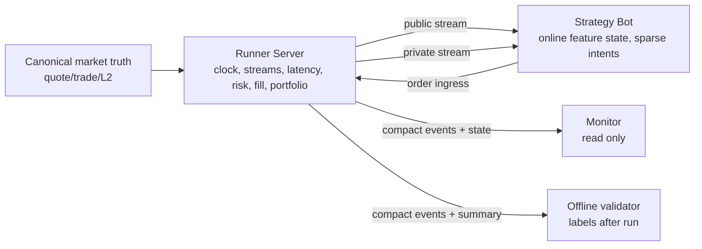
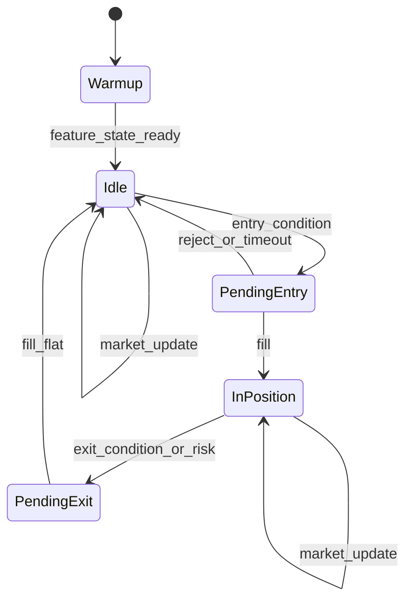

# Next Stage Three-Process Design

Status: design target, 2026-05-19.

This document defines the next CCUSDT replay exchange stage from first
principles. The goal is not to make a richer backtest script. The goal is to
make a local exchange-like system where the exchange, bot, and monitor have
different powers.

## First Principles

The system has three non-negotiable invariants:

```text
Runner owns truth and time.
Bot owns interpretation and intent.
Monitor owns observation only.
```

The causal model is:

```text
canonical market truth -> runner virtual clock -> public/private stream
-> bot online state -> sparse intent -> runner latency/risk/fill
-> compact event log -> monitor/offline validator
```

The bot's decision at virtual time `t` must be a function only of observations
available by that time:

```text
I_j = f(O_{\le t_j}, A_{\le t_j})
```

where:

```text
I_j        sparse intent j
O_{\le t} public market observations up to t
A_{\le t} private account/order/fill observations up to t
```

Forbidden runtime dependency:

```text
I_j = f(labels, scored_entries, future_return, MFE, MAE, realized PnL)
```

Post-trade labels are allowed only after the run, through an offline validator.

## Process Boundary



### Runner Server

Runner responsibilities:

```text
read canonical market truth
own virtual clock
merge quote/trade/L2 streams by local_ts_us
publish exchange-style public/private events
accept submit/cancel intents
apply latency_us and optional pressure staleness
check risk and leverage
fill orders with selected execution model
own portfolio state
write compact event log and summary
```

Runner must not:

```text
compute research labels as runtime inputs
load date/ scored entries for strategy use
depend on a specific bot process
block virtual market flow on every bot hold decision
let monitor affect clock or orders
```

### Strategy Bot

Bot responsibilities:

```text
connect to public/private streams
maintain online feature state from exchange-visible events
emit sparse submit_order/cancel_order/heartbeat
bind every intent to observed_seq and observed_local_ts_us
handle private fills and account changes
```

Bot must not:

```text
read date/
read scored_entries/path/PnL/MFE/MAE
import root scripts/ccusdt_*
control replay clock
compute leverage authority independently of Runner
```

### Monitor

Monitor responsibilities:

```text
read run state, compact events, summary, orders, fills, portfolio
show current clock, position, PnL, latency, slippage, risk status
support drilldown around order/fill causal chains
```

Monitor must not:

```text
submit orders
advance clock
change strategy parameters during the run
be required for runner or bot progress
```

## Protocol Channels

The first independent-process implementation should keep protocols simple:

```text
public stream   NDJSON TCP or WebSocket, runner -> bot/monitor
private stream  NDJSON TCP or WebSocket, runner -> bot/monitor
order ingress   NDJSON TCP or HTTP POST, bot -> runner
state query      HTTP GET, monitor -> runner
event log        local NDJSON written by runner
```

Kafka, Redis, and NATS are unnecessary until one-machine replay becomes a real
throughput bottleneck. The first target is local realism and deterministic
reproducibility, not distributed architecture.

## Public Stream

Public events are exchange-visible market events:

```text
market_quote
market_trade
market_l2_update
session_start
session_end
```

Envelope:

```json
{
  "type": "market_quote",
  "channel": "public",
  "run_id": "run",
  "seq": 123,
  "exchange_ts_us": 1779062476207000,
  "local_ts_us": 1779062476433743,
  "payload": {}
}
```

The `seq` is a stream event sequence, not necessarily a quote-frame sequence.
The original canonical row sequence remains inside payload when needed.

## Private Stream

Private events are account-visible exchange events:

```text
account_snapshot
order_ack
order_reject
cancel_ack
cancel_reject
fill
risk_reject
```

Private events must be emitted by Runner after Runner has applied latency,
risk, and fill rules. The bot may update state from these events but may not
retroactively change the intent that caused them.

## Order Ingress

Order ingress message:

```json
{
  "type": "submit_order",
  "client_order_id": "bot-0001",
  "observed_seq": 123,
  "observed_local_ts_us": 1779062476433743,
  "side": "buy",
  "kind": "market",
  "qty": 10.0,
  "tif": "ioc",
  "reduce_only": false,
  "reason": "entry_tfi_state"
}
```

Runner validates:

```text
observed_seq exists and is not in the future
observed_local_ts_us <= runner current local_ts_us
kind/tif are supported by selected execution mode
qty is finite and positive
risk/leverage checks pass at arrival
```

Runner schedules:

```text
target_arrival_local_ts_us
  = observed_local_ts_us + latency_us + pressure_staleness_us
```

Order arrival:

```text
arrival event = first stream/quote state with local_ts_us >= target_arrival_local_ts_us
```

## Compact Event Log

Runtime stream and event log are different objects:

```text
stream: dense communication needed by bot
log: sparse audit evidence needed after run
```

Default compact log permanently records:

```text
run_start
order_intent
order_scheduled
order_arrived
order_ack
order_reject
cancel_ack
cancel_reject
risk_reject
fill
portfolio_state_on_change
latency_slippage
run_end
summary
```

Default compact log does not record every:

```text
market_quote
market_trade
market_l2_update
hold
heartbeat
strategy_message_sent
strategy_message_received
```

Optional audit mode may record dense protocol traffic:

```text
log_mode=compact   causal chain and state changes only
log_mode=audit     compact + sampled market context + signal snapshots
log_mode=full      every stream message and every bot response
```

The expected log scale changes from:

```text
O(market_events)
```

to:

```text
O(orders + fills + state_changes + summaries)
```

for compact mode.

## Sparse Intent State Machine

The bot should not answer every event with a hold. It should update internal
state on every event and output only when a real action exists.



Bot outputs:

```text
submit_order   entry/exit intent
cancel_order   stale pending order, if supported
heartbeat      wall-clock or virtual-clock interval only
```

Response complexity:

```text
N_bot_outputs ~= N_orders + N_cancels + N_heartbeat_intervals
```

not:

```text
N_bot_outputs ~= N_market_events
```

Each intent stores:

```text
observed_seq
observed_local_ts_us
feature_snapshot_id or compact feature snapshot
reason code
client_order_id
```

This is enough to reconstruct why the bot acted without logging every hold.

## Online Feature State Module

Online features live in the bot, not Runner.

Runner emits market truth. Bot reconstructs pretrade-safe factors:

```text
spread_bps_t = (ask_t - bid_t) / mid_t * 10000
mid_change_t = mid_t - mid_{t-1}
frames_since_mid_change_t
rolling_buy_qty_W
rolling_sell_qty_W
trade_imbalance_W = (buy_qty_W - sell_qty_W) / (buy_qty_W + sell_qty_W + eps)
TFI_W = signed_trade_flow_W / (abs_trade_flow_W + eps)
quote_age_us
top_depth
L2 imbalance if L2 is enabled
```

The feature state can maintain rolling windows by virtual time:

```text
W_t = {event i: local_ts_us_i >= local_ts_us_t - window_us}
```

Every feature must be computable from:

```text
market_quote, market_trade, market_l2_update, private events up to time t
```

Feature snapshots at intent time are allowed in the compact log. Full rolling
history is not required in compact mode.

## Streaming Merge Iterator

Full-day L2 cannot be loaded into memory as `Vec<L2LevelUpdate>`.

The runner should read canonical datasets as iterators:

```text
quote_iter
trade_iter
l2_iter
```

and emit the next event by local time:

```text
next_event = argmin(local_ts_us(next_quote),
                    local_ts_us(next_trade),
                    local_ts_us(next_l2))
```

Tie-breaking should be deterministic:

```text
quote before trade before L2 when local_ts_us is equal
```

because quote is the clock/mark base for top-of-book fills, trades update flow
features, and L2 may contain many rows for the same timestamp.

Memory target:

```text
O(active_book_levels + rolling_feature_windows + pending_orders)
```

not:

```text
O(full_day_l2_rows)
```

L2 batching rule:

```text
batch all L2 rows with same local_ts_us up to max_batch_rows
```

If a timestamp has more than `max_batch_rows`, emit multiple batches with the
same `local_ts_us` and increasing batch index.

## Execution Models

Two taker execution models should coexist.

### top_of_book_taker_ioc_v1

Baseline:

```text
market buy  -> arrival ask
market sell -> arrival bid
```

No partial fill in this model. It is conservative for latency and spread, but
optimistic for size when order quantity exceeds top depth.

### l2_taker_depth_v1

Optional fill model:

```text
market buy  sweeps asks from best ask upward
market sell sweeps bids from best bid downward
```

Output fields:

```text
requested_qty
filled_qty
remaining_qty
vwap
top_price
depth_slippage_bps
partial_fill
levels_consumed
reason
```

Slippage:

```text
buy_depth_slippage_bps  = ln(vwap / best_ask) * 10000
sell_depth_slippage_bps = ln(best_bid / vwap) * 10000
```

Fill event must include:

```text
observed_quote
arrival_quote
arrival_book_summary
latency_us
effective_latency_us
latency_slippage_bps
depth_slippage_bps
fee_bps
execution_model
```

## Monitor Boundary

Monitor is last because it must not shape the hot path.

Monitor reads:

```text
run state
summary
compact events
orders
fills
portfolio
latency/slippage summaries
```

Monitor should support:

```text
current state
order chain drilldown
fill list
portfolio curve
latency/slippage distribution
log mode indicator
bot heartbeat status
```

Monitor does not read strategy labels as runtime inputs and does not submit
orders.

## Implementation Order

1. Keep current stdio deterministic bridge for unit/smoke regression.
2. Add stream/event contract docs and compact log mode in Runner.
3. Add streaming canonical iterators and merge iterator.
4. Extract Python bot into sparse-output client with online feature state.
5. Add independent Runner Server streams and order ingress.
6. Promote `l2_taker_depth_v1` from smoke diagnostic to optional fill model.
7. Add read-only monitor after runner/bot are stable.

## Acceptance Criteria

The next stage is acceptable only if:

```text
2026-05-18 full-day quote+trade can run without full-day Vec loading
optional L2 runs stream through bounded memory
bot feature state is reconstructed only from exchange-visible events
bot outputs sparse intents, not per-event holds
compact event log can replay every order causal chain
L2 depth fill model reports VWAP, partial fill, remaining qty, reason
monitor is read-only and outside the trading hot path
no runtime path reads date/, scored_entries, labels, PnL, MFE, or MAE
```
